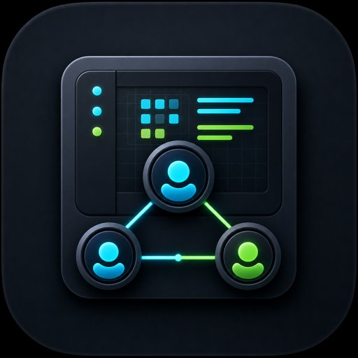

<p align="center">
  
</p>

<h1 align="center">AgentBoard</h1>

<p align="center">
  看清每个 Codex agent 正在做什么、什么时候完成、什么时候需要你批准。
</p>

<p align="center">
  =22.18.0" src="https://img.shields.io/badge/node-%3E%3D22.18.0-339933?logo=node.js&logoColor=white">
  
  
  
</p>

<p align="center">
  <a href="README.md">English</a> | 简体中文
</p>

`AgentBoard` 是一个本地 Codex agent 状态看板。它会观察 Codex App Server 状态，把线程、子代理、等待审批、等待输入、错误和完成状态统一成可读的 Agent 记录，突出“已完成”“需要批准”等状态转换提示，借助 [euphony](https://github.com/openai/euphony) 渲染会话消息列表，并提供内置 Web UI、JSON API 和 SSE 事件流。

> [!IMPORTANT]
> AgentBoard 目前只支持 Codex agent，并且只观察本地 Codex 状态。它不会审批请求、发送用户输入、停止代理、修改 Codex 会话，也不会给 shell 或 Codex 工作流安装 hook。

## 为什么需要 AgentBoard

当你同时跑多个 Codex 任务、子代理或长时间调试流程时，终端窗口很快会变成黑盒：谁还在工作、谁卡在审批、哪个会话已经完成、哪个 App Server 连接失效，都不够直观。

`AgentBoard` 给这类本地工作流补了一个只读观察层：

- 一眼看到所有 Codex 线程和子代理的当前状态
- 在 agent 完成、报错、进入审批等待或输入等待时看到状态转换提示
- 直接打开渲染后的消息列表，不需要手动读 Codex session JSONL
- 用浏览器打开本地看板，不需要外部服务
- 用 HTTP JSON/SSE 把状态接进脚本、通知或自定义 dashboard
- 保留原始状态证据，方便排查 Codex App Server 行为

## 功能亮点

| 能力 | 说明 |
| --- | --- |
| 实时代理清单 | 展示 main agent、sub-agent、父子线程关系和工作目录 |
| Codex agent 工作状态 | 显示哪些 agent 正在工作、空闲、已完成、等待批准、等待输入或报错 |
| 状态转换提示 | 突出已完成、需要批准、需要输入、出错等关键变化 |
| 状态归一化 | 输出 `idle`、`working`、`finished`、`waiting_approval`、`waiting_input`、`error`、`unknown` |
| App Server 健康信息 | 显示连接状态、运行模式、Codex CLI 版本、最近错误和刷新时间 |
| 内置 Web UI | 表格视图 + 像素风 Office 视图，支持状态、类型、活跃时间、cwd 和搜索过滤 |
| 消息列表渲染 | 每个 Agent 都可以打开 `View messages`，用 vendored [euphony](https://github.com/openai/euphony) 渲染 Codex session |
| 本地 API | 提供 `/status`、`/agents`、`/health`、`/events` 等 JSON/SSE 端点 |

## 设计亮点

- **非侵入式设计**：AgentBoard 不安装 shell hook，不 patch Codex，不包裹 prompt，也不介入 agent 执行链路。
- **只读观察者**：它通过 Codex App Server API 和本地 session evidence 观察状态，只展示信息，不修改会话。
- **状态优先**：看板围绕 agent 工作状态和状态转换设计，而不是先把原始日志堆给用户。
- **可读消息渲染**：会话页复用 [euphony](https://github.com/openai/euphony)，把 Codex 消息渲染成结构化对话视图，而不是裸 JSONL。

## 快速开始

### 环境要求

- Node.js `>=22.18.0`
- 本机可执行 `codex`
- 支持 App Server 的 Codex CLI 版本

当前项目布局不需要额外 build step。浏览器端 euphony 资源已 vendored 到 `src/ui/vendor/euphony`。

### 启动

```bash
npm start
```

默认监听 `127.0.0.1:17345`，启动后会打印：

```text
codex-status listening at http://127.0.0.1:17345
```

打开 Web UI：

```text
http://127.0.0.1:17345/ui
```

查询当前快照：

```bash
curl http://127.0.0.1:17345/status
curl "http://127.0.0.1:17345/agents?status=working"
```

> [!NOTE]
> README 中统一使用产品名 `AgentBoard`。项目包名和 CLI bin 仍是 `codex-status`，所以启动输出和 `package.json` 会继续保留这个名称。

## 常用命令

```bash
node src/cli.ts daemon [options]
```

| 参数 | 默认值 | 说明 |
| --- | --- | --- |
| `--host <host>` | `127.0.0.1` | HTTP 绑定地址 |
| `--port <port>` | `17345` | HTTP 绑定端口，`0` 表示使用临时端口 |
| `--no-start-app-server` | disabled | 不自动启动 App Server，只通过 `codex app-server proxy` 连接 |
| `--refresh-interval-ms <ms>` | `5000` | 快照刷新、重连和 stale 检查间隔 |
| `--stale-after-ms <ms>` | `30000` | App Server 断连且无新事件后，多久把代理标为 stale |

示例：

```bash
node src/cli.ts daemon --host 0.0.0.0 --port 18000 --refresh-interval-ms 2000
```

## 使用场景

- **多任务并行监控**：同时跑多个 Codex 任务时，快速识别仍在工作的 Agent。
- **状态转换提示**：看到 agent 已完成、失败、开始等待批准或等待输入。
- **审批/输入提醒**：过滤 `waiting_approval` 或 `waiting_input`，快速跳到卡住的会话。
- **子代理关系排查**：查看 main agent 和 sub-agent 的父子线程关系。
- **消息列表回看**：打开由 [euphony](https://github.com/openai/euphony) 渲染的会话页，而不是直接阅读 JSONL。
- **本地脚本集成**：通过 `/status`、`/agents` 或 `/events` 接入通知、状态栏、CI 辅助脚本。
- **App Server 调试**：观察连接模式、最近错误、stale 状态和原始状态证据。

## Web UI

内置 UI 面向本地运维和调试，不是营销页。启动 daemon 后访问：

```text
http://127.0.0.1:17345/ui
```

它包含：

- App Server 连接行：mode、CLI version、daemon version、last load time、refresh state
- 汇总计数：total、working、idle、finished、approval/input waiting、error、unknown
- 可过滤表格：按 status、kind、active time window、cwd、关键字搜索
- `Table` / `Office` 切换：Office 会把过滤后的 Agent 渲染成像素风团队工位
- 父子关系折叠：Codex 暴露父线程时，子代理默认折叠在父 Agent 下
- 重要状态转换提醒：例如 main agent 从 working 变为 finished，或进入 approval/input waiting
- stale 标记：App Server 断连并超过 `--stale-after-ms` 后显示 stale
- JSON 详情：展开单个 Agent 查看原始状态、时间戳和调试字段
- 会话消息：`View messages` 打开 agent session 页面，由 [euphony](https://github.com/openai/euphony) 渲染

UI 在启用自动刷新时每 3 秒轮询 `/health` 和 `/status`。Office 视图会复用表格过滤条件；建议把 `Active within` 设置为 `30min` 或 `3h`，让画面聚焦当前活跃任务。

## HTTP API

所有端点都是本地 HTTP `GET` 路由。

| 路由 | 返回 |
| --- | --- |
| `GET /ui` | Web dashboard HTML |
| `GET /ui/` | Web dashboard HTML |
| `GET /health` | daemon 和 App Server 健康快照 |
| `GET /status` | 完整状态快照，包含 summary 和 agents |
| `GET /agents` | Agent 列表，支持 `status`、`kind`、`cwd`、`activeWithinMs` 过滤 |
| `GET /agents/:id` | 单个 Agent，按 thread ID 查询 |
| `GET /agents/:id/session` | Agent 元数据和解析后的 Codex session JSONL events |
| `GET /events` | Server-Sent Events，推送 `agent.updated` |

过滤示例：

```bash
curl "http://127.0.0.1:17345/agents?status=waiting_approval"
curl "http://127.0.0.1:17345/agents?kind=sub_agent"
curl "http://127.0.0.1:17345/agents?cwd=/path/to/project"
curl "http://127.0.0.1:17345/agents?status=working&activeWithinMs=1800000"
```

`activeWithinMs` 会筛选最近活跃的 Agent。活跃时间取 `updatedAt`、`lastTurn.startedAt`、`lastTurn.completedAt` 中最新的值；它不会使用本地观察时间 `lastEventAt`。

`GET /status` 返回结构示例：

```json
{
  "generatedAt": 1780000000000,
  "summary": {
    "total": 2,
    "working": 1,
    "idle": 1,
    "finished": 0,
    "waitingApproval": 0,
    "waitingInput": 0,
    "error": 0,
    "unknown": 0
  },
  "agents": []
}
```

`GET /events` 会推送类似事件：

```text
event: agent.updated
data: {"type":"agent.updated","agentId":"thread-id","status":"working","at":1780000000000}
```

## Agent 数据模型

每条 Agent 记录都来自一个 Codex App Server thread。

| 字段 | 说明 |
| --- | --- |
| `id` | App Server thread ID |
| `sessionId` | Codex session ID |
| `kind` | `main_agent`、`sub_agent` 或 `unknown` |
| `displayName` | 从 nickname、role、thread name、preview 或 ID 推导出的显示名 |
| `status` | 公开归一化状态 |
| `rawStatus` | 最新状态证据，通常来自 App Server thread status |
| `cwd` | thread 工作目录 |
| `preview` | Codex thread preview 文本 |
| `modelProvider` | Codex 上报的模型提供方 |
| `cliVersion` | App Server thread 上报的 Codex CLI 版本 |
| `createdAt` / `updatedAt` | 归一化为 Unix milliseconds 的 thread 时间戳 |
| `parentThreadId` | Codex 暴露时的父 thread ID |
| `agentNickname` / `agentRole` | 子代理身份提示 |
| `lastTurn` | 最近 turn 的状态和时间戳 |
| `waitingSince` | 首次观察到审批/输入等待状态的时间 |
| `lastEventAt` | AgentBoard 本地观察到的最近更新时间 |
| `stale` | App Server 断连且超过 stale 阈值时为 `true` |

当前状态映射：

| App Server 信号 | 公开状态 |
| --- | --- |
| `idle` | `idle` |
| `notLoaded` | `unknown` |
| `active` | `working` |
| `active` + `waitingOnApproval` | `waiting_approval` |
| `active` + `waitingOnUserInput` | `waiting_input` |
| completed turn，或带 `completedAt` 的 interrupted turn | `finished` |
| `systemError` 或 failed turn | `error` |
| 无法识别的 payload | `unknown` |

## App Server 生命周期

启动时，AgentBoard 会先运行 `codex --version`，然后用两种模式之一连接 Codex App Server：

| 模式 | 触发条件 | AgentBoard 拥有的进程 |
| --- | --- | --- |
| `external-daemon` | `codex app-server daemon start` 成功，或使用 `--no-start-app-server` | 本地 `codex app-server proxy` 进程；外部 daemon 仍由 Codex CLI 管理 |
| `managed-child` | managed standalone daemon 不可用且允许自动启动 | 子进程 `codex app-server --listen stdio://` |

运行期间，daemon 会读取初始 thread 列表，按配置间隔刷新 App Server 快照，应用 App Server notifications，在断连后标记 stale，并在需要时重连。关闭时只停止自己启动的进程。

## 开发

运行单元测试：

```bash
npm test
```

运行真实本地 Codex App Server-capable CLI 的 smoke test：

```bash
npm run smoke:real
```

项目结构：

```text
src/
  app-server/      Codex App Server supervisor and JSON-RPC client
  domain/          Thread-to-agent normalization
  http/            JSON/SSE API and UI asset server
  store/           In-memory status store and health snapshots
  ui/              Built-in browser UI
  cli.ts           CLI entrypoint
  config.ts        CLI parsing and defaults
  daemon.ts        Daemon orchestration
tests/             Node test suite
scripts/           Real App Server smoke test
```

## 更新 Vendored Euphony

AgentBoard 会从 `src/ui/vendor/euphony` 提供已 check-in 的 euphony 浏览器资源。要从 euphony checkout 刷新它们：

```bash
scripts/update-euphony-vendor.sh /path/to/euphony
```

脚本会用 `corepack pnpm run build:library` 构建 euphony，替换 vendored assets，并把来源 commit 信息写到 `src/ui/vendor/euphony/VENDOR.md`。vendored 目录同时包含 euphony 的 Apache-2.0 `LICENSE` 和 `NOTICE` 文件。

## 故障排查

| 现象 | 检查 |
| --- | --- |
| `codex --version failed` | 确认 Codex CLI 已安装并在 `PATH` 上 |
| HTTP 端口被占用 | 使用 `--port <free-port>`，或 `--port 0` 启用临时端口 |
| `/health` 显示 `connected: false` | 查看 `appServer.lastError`；daemon 会按 `--refresh-interval-ms` 重试 |
| Agent 显示为 `stale` | App Server 已断连，且超过 `--stale-after-ms` 没有收到新事件 |
| Agent `rawStatus` 是 `notLoaded` | App Server 有 thread 元数据，但没有 live runtime、进行中 turn、item activity、历史 live evidence 或新状态通知 |
| 没有任何 Agent | 在同一个本地环境启动或恢复 Codex 工作，然后刷新 `/ui` 或查询 `/status` |
| `npm run smoke:real` 失败 | 确认当前 Codex CLI 支持 `codex app-server` 命令 |
